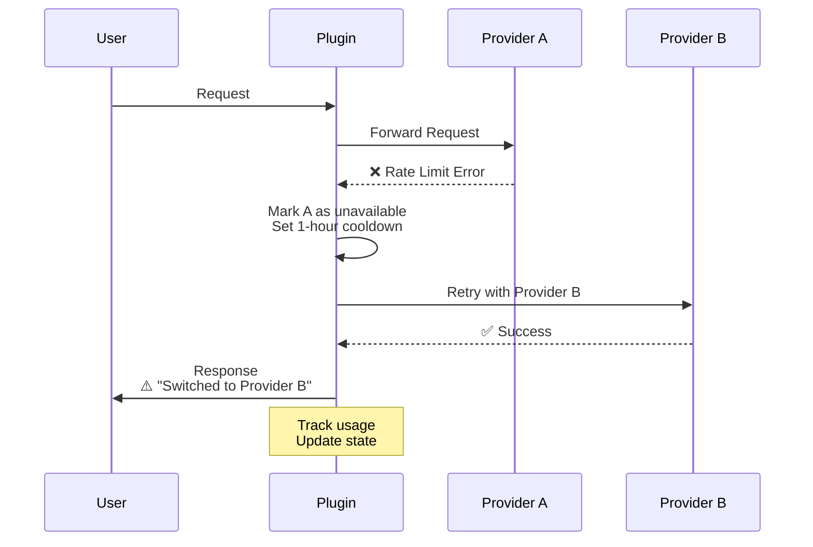

# OpenCode Rate Limit Manager Plugin

**Intelligent multi-provider management with automatic failover for OpenCode**

Automatically switch between multiple AI providers when rate limits are hit, ensuring uninterrupted coding sessions.

## Features

✅ **Automatic Provider Switching** - Seamlessly failover to alternative providers  
✅ **Usage Tracking** - Monitor requests per provider with hourly/daily limits  
✅ **Smart Cooldowns** - Intelligent backoff after hitting rate limits  
✅ **Priority Routing** - Configure preferred provider order  
✅ **Real-time Notifications** - Get alerted when providers switch  
✅ **Persistent State** - Usage data survives restarts  

---

## Quick Start

### 1. Installation

```bash
# Clone or download these files:
# - rate-limit-manager.ts
# - setup.sh
# - opencode.json.example

# Run setup script
chmod +x setup.sh
./setup.sh
```

### 2. Configure Providers

Edit `opencode.json`:

```json
{
  "$schema": "https://opencode.ai/config.json",
  "model": "anthropic/claude-sonnet-4-5",
  
  "provider": {
    "anthropic": {
      "options": { "apiKey": "${ANTHROPIC_API_KEY}" }
    },
    "openrouter": {
      "npm": "@ai-sdk/openai-compatible",
      "options": {
        "baseURL": "https://openrouter.ai/api/v1",
        "apiKey": "${OPENROUTER_API_KEY}"
      },
      "models": {
        "claude-sonnet-4-5": {
          "id": "anthropic/claude-sonnet-4.5"
        }
      }
    }
  },
  
  "plugin": ["rate-limit-manager"]
}
```

### 3. Set Rate Limits

Edit `.opencode/plugin/rate-limit-manager.ts`:

```typescript
const PROVIDER_CONFIGS: ProviderConfig[] = [
  {
    id: "anthropic",
    models: ["claude-sonnet-4-5"],
    hourlyLimit: 50,    // Your tier limit
    dailyLimit: 1000,   // Your tier limit
    priority: 1,        // First choice
  },
  {
    id: "openrouter",
    models: ["claude-sonnet-4-5"],
    hourlyLimit: 100,
    dailyLimit: 2000,
    priority: 2,        // Fallback
  },
]
```

### 4. Add API Keys

Create `.env`:

```bash
ANTHROPIC_API_KEY=sk-ant-xxxxx
OPENROUTER_API_KEY=sk-or-xxxxx
```

### 5. Run OpenCode

```bash
opencode
```

The plugin will automatically:
- Track usage per provider
- Switch on rate limits
- Show notifications
- Persist state across sessions

---

## How It Works



---

## Configuration

### Provider Setup

#### Anthropic Direct

```json
"anthropic": {
  "options": {
    "apiKey": "${ANTHROPIC_API_KEY}",
    "timeout": 60000
  }
}
```

#### OpenRouter

```json
"openrouter": {
  "npm": "@ai-sdk/openai-compatible",
  "options": {
    "baseURL": "https://openrouter.ai/api/v1",
    "apiKey": "${OPENROUTER_API_KEY}"
  },
  "models": {
    "claude-sonnet-4-5": {
      "id": "anthropic/claude-sonnet-4.5"
    }
  }
}
```

#### Helicone (with caching)

```json
"helicone": {
  "npm": "@ai-sdk/openai-compatible",
  "options": {
    "baseURL": "https://anthropic.helicone.ai/v1",
    "apiKey": "${ANTHROPIC_API_KEY}",
    "headers": {
      "Helicone-Auth": "Bearer ${HELICONE_API_KEY}",
      "Helicone-Cache-Enabled": "true"
    }
  },
  "models": {
    "claude-sonnet-4-5": {}
  }
}
```

#### Together AI

```json
"together-ai": {
  "npm": "@ai-sdk/openai-compatible",
  "options": {
    "baseURL": "https://api.together.xyz/v1",
    "apiKey": "${TOGETHER_API_KEY}"
  },
  "models": {
    "llama-3-1-70b": {
      "id": "meta-llama/Meta-Llama-3.1-70B-Instruct-Turbo"
    }
  }
}
```

### Rate Limit Customization

```typescript
// In rate-limit-manager.ts

const COOLDOWN_DURATION_MS = 60 * 60 * 1000 // 1 hour

const RATE_LIMIT_ERROR_PATTERNS = [
  /rate limit/i,
  /too many requests/i,
  /429/,
  /quota exceeded/i,
  /overloaded_error/i,  // Anthropic specific
]
```

---

## Usage

### Check Status

While in OpenCode, run:

```
/rate_limit_status
```

**Output:**
```
=== Rate Limit Manager Status ===

anthropic: ✗ Unavailable
  Models: claude-sonnet-4-5
  Requests: 50/50
  Cooldown until: 1/12/2026, 5:30:00 PM

openrouter: ✓ Available
  Models: claude-sonnet-4-5
  Requests: 23/100

Current Provider: openrouter
```

### Monitor Logs

```bash
tail -f ~/.local/share/opencode/logs/app.log | grep rate-limit
```

### Reset State

If you need to reset usage counters:

```bash
rm .opencode/rate-limit-state.json
```

---

## Architecture

### State Management

```typescript
{
  "providers": {
    "anthropic": {
      "requestCount": 45,
      "hourlyLimit": 50,
      "cooldownUntil": null,
      "isAvailable": true,
      "errorCount": 0
    },
    "openrouter": {
      "requestCount": 12,
      "hourlyLimit": 100,
      "isAvailable": true
    }
  },
  "currentProvider": "anthropic",
  "modelMapping": {
    "claude-sonnet-4-5": ["anthropic", "openrouter"]
  }
}
```

### Event Hooks

The plugin uses OpenCode's event system:

- **`session.created`** - Initialize tracking
- **`session.error`** - Detect rate limits
- **`session.idle`** - Reset daily counters
- **`message.updated`** - Track usage

### Failover Strategy

1. **Check current provider** → Is it available?
2. **Rate limit hit?** → Put in cooldown
3. **Find alternative** → Next provider with same model
4. **Switch provider** → Update state
5. **Notify user** → Show toast message
6. **Retry request** → Use new provider

---

## Troubleshooting

### Plugin Not Loading

**Symptom:** No logs from rate-limit-manager

**Solution:**
```bash
# Verify plugin file exists
ls -la .opencode/plugin/rate-limit-manager.ts

# Check for syntax errors
cd .opencode
bun run plugin/rate-limit-manager.ts

# Verify plugin is enabled in opencode.json
cat opencode.json | grep plugin
```

### Provider Not Switching

**Symptom:** Rate limit errors but no failover

**Solution:**
1. Check error patterns match:
   ```typescript
   // Add more patterns if needed
   const RATE_LIMIT_ERROR_PATTERNS = [
     /rate limit/i,
     /your specific error pattern/i,
   ]
   ```

2. Verify alternative providers are configured:
   ```bash
   # Check config
   cat opencode.json | grep -A 10 provider
   ```

3. Check logs:
   ```bash
   grep "rate-limit" ~/.local/share/opencode/logs/app.log
   ```

### State Not Persisting

**Symptom:** Usage resets on restart

**Solution:**
```bash
# Check file permissions
ls -la .opencode/rate-limit-state.json
chmod 644 .opencode/rate-limit-state.json

# Verify directory exists
mkdir -p .opencode

# Check for write errors in logs
grep "Failed to save state" ~/.local/share/opencode/logs/app.log
```

### High Error Count

**Symptom:** errorCount keeps increasing

**Solution:**
1. Verify API keys are valid
2. Check provider status pages
3. Adjust limits to match your tier
4. Review error patterns

---

## Best Practices

### 1. Set Realistic Limits

```typescript
// Match your actual API tier
{
  id: "anthropic",
  hourlyLimit: 50,    // Claude Pro: 50/hour
  dailyLimit: 1000,   // Claude Pro: 1000/day
}
```

### 2. Order by Priority

```typescript
// List providers by preference
const PROVIDER_CONFIGS: ProviderConfig[] = [
  { id: "primary", priority: 1 },    // Try first
  { id: "fallback", priority: 2 },   // Then this
  { id: "emergency", priority: 3 },  // Last resort
]
```

### 3. Monitor Regularly

```bash
# Add to cron or watch
watch -n 60 'grep rate-limit ~/.local/share/opencode/logs/app.log | tail -20'
```

### 4. Use Caching

```json
// Helicone with caching reduces requests
"headers": {
  "Helicone-Cache-Enabled": "true",
  "Helicone-Cache-Seed": "your-seed"
}
```

### 5. Git Ignore State

```bash
# Add to .gitignore
echo ".opencode/rate-limit-state.json" >> .gitignore
```

---

## Advanced Usage

### Custom Error Handling

```typescript
// Extend error patterns
const RATE_LIMIT_ERROR_PATTERNS = [
  /rate limit/i,
  /overloaded/i,
  /quota/i,
  // Provider-specific patterns
  /anthropic.*429/i,
  /openrouter.*limit/i,
]
```

### Dynamic Configuration

```typescript
// Load providers from environment
const PROVIDER_CONFIGS = process.env.PROVIDERS
  ? JSON.parse(process.env.PROVIDERS)
  : defaultConfigs
```

### Webhooks

Add notifications to your workflow:

```typescript
async function notifySlack(event: string, data: any) {
  await fetch(process.env.SLACK_WEBHOOK!, {
    method: "POST",
    body: JSON.stringify({ text: `[OpenCode] ${event}: ${data}` })
  })
}

// In handleRateLimitError:
await notifySlack("Rate Limit", `Provider ${providerId} exhausted`)
```

---

## API Reference

### State Manager

```typescript
class StateManager {
  getState(): State
  updateProvider(id: string, updates: Partial<ProviderState>): void
  setCurrentProvider(id: string): void
  incrementRequestCount(id: string): void
  resetCounters(): void
}
```

### Provider Manager

```typescript
class ProviderManager {
  isProviderAvailable(id: string): boolean
  findAvailableProvider(model: string, exclude?: string[]): string | null
  getBestProvider(model: string): string | null
  handleRateLimitError(id: string, error: string): string | null
  getStatusReport(): string
}
```

---

## Performance

- **Memory:** ~1MB state file
- **CPU:** Negligible overhead
- **Disk I/O:** Write on state change only
- **Network:** No additional API calls

---

## Security

✅ API keys stored in OpenCode's auth system  
✅ State file is local only  
✅ No external tracking or telemetry  
✅ Git-ignored by default  

---

## Contributing

Found a bug or have a feature request?

1. Check existing issues
2. Open a new issue with details
3. Submit a PR with tests

---

## Resources

- **OpenCode Docs:** https://opencode.ai/docs/
- **Plugin API:** https://opencode.ai/docs/plugins/
- **SDK Reference:** https://opencode.ai/docs/sdk/
- **Discord:** https://opencode.ai/discord

---

## License

MIT License - See LICENSE file for details

---

## Support

For questions or issues:
- Open a GitHub issue
- Ask in OpenCode Discord
- Email: support@yourproject.com

---

**Made with ❤️ for the OpenCode community**
